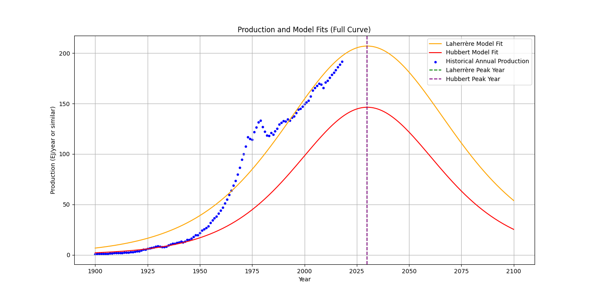

# PetroCast: A Scientific Tool for Oil and Resource Modeling and Forecasting

PetroCast is a Python-based scientific modeling package designed to compare the accuracy 
and forecasting power of different resource extraction models used by the scientific community, 
with an initial focus on oil production. This tool helps researchers analyze historical trends, 
project future extraction rates, and evaluate model performance under shared assumptions, 
such as a common Ultimate Recoverable Resource (URR) value. The model can be applied to other resources
by following the instructions for the configuration file below. 

In future versions, additional models and resource types (e.g., natural gas, coal, copper etc.) 
will be added, making PetroCast a versatile tool for resource modeling and forecasting.
---------------------------------------------------------------------------------------------------------------------
## **Overview**:
---------------------------------------------------------------------------------------------------------------------
    Current Models Include: 
        Hubbert Model: Symmetric production curve for peak oil analysis.
        Laherrère Model: Flexible asymmetric production curve, tailored for resource extraction modeling.
    Comparative Analysis: 
        Compare model accuracy with historical data.
        Evaluate model projections for future production under identical URR assumptions.
    Cumulative Production Analysis:
        Calculate cumulative production based on historical data and model forecasts.
        Convert production units (e.g., from Exajoules to Giga barrels).
    Visualization:
        Generate annotated plots showing historical data, model fits, and future projections.
    Extensibility:
        Easily integrate additional models or resources in future versions.
---------------------------------------------------------------------------------------------------------------------
## **Installation**:
---------------------------------------------------------------------------------------------------------------------
### **Prerequisites**
---------------------------------------------------------------------------------------------------------------------
- Python 3.8+
- Required dependencies: `numpy`, `pandas`, `matplotlib`, `scipy`, `tomli` , `pylint` , `pytest`
---------------------------------------------------------------------------------------------------------------------
### **Install PetroCast Locally**
---------------------------------------------------------------------------------------------------------------------
Clone the repository git clone https://github.com/OlevanA/petrocastm.git

Run the following command inside the project directory:
```sh
pip install -e .
```
To verify installation:
```sh
pip list | grep petrocast  # macOS/Linux
pip list | findstr petrocast  # Windows
```
---------------------------------------------------------------------------------------------------------------------
## ** Simple Usage**
---------------------------------------------------------------------------------------------------------------------
Execute the program using the default example:
```sh
petrocast example_1 # or petrocast example_2....petrocast example_11
```
Run the this command to get help in the terminal
```sh
petrocast --help
```
The default example means that we use the same historical production dataset which is based on a data set 
from the Havard university, with oil production data from 1900-2018 in Exajoules (EJ), and different 
Ultimate Recoverable Resource (URR) values in EJ. In total eleven estimates are available from the literature. 
See below:

| Estimations | Oil endowments in Literature                                    | Gb          | EJ          |
|-------------|-----------------------------------------------------------------|-------------|-------------|
| Estimate 1  | Laherrare et al. (2022) Reserves + Cumulative Extraction        | 2350.0      | 13423.2     |
| Estimate 2  | IEA Reserves + Cumulative Extraction                            | 3353.0      | 19152.336   |
| Estimate 3  | BGR Reserves + Cumulative Extraction                            | 3397.1694   | 19404.63161 |
| Estimate 4  | Mohr et al. (2015) Low Estimate of URR                          | 3536.939776 | 20203.0     |
| Estimate 5  | Laherrare (2018) Ultimate Recoverable Resources (URR)           | 3586.236105 | 20484.58063 |
| Estimate 6  | Laherrare (2023) Ultimate Recoverable Resources (URR)           | 3800.0      | 21705.6     |
| Estimate 7  | Mohr et al. (2015) BG Estimate of URR                           | 4393.557423 | 25096.0     |
| Estimate 8  | BG Laherrare et al. (2022) Ultimate Recoverable Resources (URR) | 5000.0      | 28560.0     |
| Estimate 9  | BGR Reserves + Resources + Cumulative Extraction                | 7070.78948  | 40388.34951 |
| Estimate 10 | Mohr et al. (2015) High Estimate of URR                         | 7549.369748 | 43122.0     |
| Estimate 11 | IEA Resources* + Cumulative Extraction                          | 7806.0      | 44587.872   |

---------------------------------------------------------------------------------------------------------------------
## **Configuration Options**
---------------------------------------------------------------------------------------------------------------------
The user has the option to configure petrocast to run with her/his own example data which must contain historical 
production data from a resource in one Unit and an Ultimate Recoverable Resources (URR) Estimation or a CSV of 
different URR Estimations in the same unit.  

- `dataset`: Path to the historical production dataset.
- `urr_file`: Path to the CSV file containing URR estimates.
- `output_path` Path to the visualisation of the model results 
- `unit`: Choose between **EJ (Exajoules)** or **Gb (Gigabarrels)**or **oth (Other)**.

---------------------------------------------------------------------------------------------------------------------
### **Current structure of the Configuration File and how to prepare this file (`config.toml`)**
---------------------------------------------------------------------------------------------------------------------
Create a `config.toml` file with the following structure:
```toml
dataset = "data/raw/data1_oil_his_havard.csv"# here the user can change the current setup to 
#refer to his/her own production dataset
urr_file = "data/processed/Oil_estimate.csv"# here the user can change the current setup to 
# refer to his/her own URR estimations. MUST BE IN THE SAME UNIT AS THE PRODUCTION DATA SET!
output_path = "examples/output/"# here the user can change the output path for the png generated
unit = "EJ"# Here the user can change the Unit that is used 
```
### ** Prepare the Configuration File and CSV Files**
If you want to use your own data, take a look at the structure of the CSV. files and make sure your files are
structured in the same way!

### ** Prepare the curve_fitting_script to set reasonable bound and expected peak times**
The curve fitting script needs to be adapted to the resources, literature research required to fill in reasonable 
estimate for the intial estimates.

# Initial guess and bounds hubbert_curve
initial_guess = [0.02, 2040]  # Needs to modified by the user according to literature suggestions!
bounds = ([0.01, 2030], [0.05, 2040])  # Needs to modified by the user!

# Initial guess and bounds laherrere model 
initial_guess = [max(production), 2040, 100]  # Peak at Year with reasonable width
bounds = ([0, 2030, 10], [np.inf, 2040, 300])  # Adjust for peak time limits

---------------------------------------------------------------------------------------------------------------------
### **2️⃣ Running the Application with own data**
---------------------------------------------------------------------------------------------------------------------

Example Execute the program using:
```sh
petrocast --config examples/config.toml --urr-key "Estimate1" #Or Estimate2...Estimate11
```
Or manually via Python:
```sh
python -m petrocast --config examples/config.toml --urr-key "Estimate1" #Or Estimate2...Estimate11
```

---
---------------------------------------------------------------------------------------------------------------------
## **Example Output with Example_1**
```
---------------------------------------------------------------------------------------------------------------------

Using dataset: data/raw/data1_oil_his_havard.csv
The estimated Ultimate Recoverable Resources (URR) is 13,423.2 EJ (Key: Estimate 1)

Laherrère Model Parameters:
   - Peak Production Rate: 207.05 EJ/year
   - Peak Year: 2030
   - Curve Width (Steepness): 135.19

Hubbert Model Parameters:
   - Ultimate Recoverable Resources (URR): 13,423.2 EJ
   - Steepness: 0.0436
   - Peak Year: 2030
   
   Example figure is saved under examples output showing the curves from both models, 
   indicating the peak production year and the decline of production in the future.
```
Example output :

---
---------------------------------------------------------------------------------------------------------------------
## **Development**
--------------------------------------------------------------------------------------------------------
### **Run Tests**
```sh
pytest tests/
```
### **Run pylint**
```sh
pylint petrocast
```

---
---------------------------------------------------------------------------------------------------------------------
## **License**
This project is licensed under the MIT License. See `LICENSE` for details.
